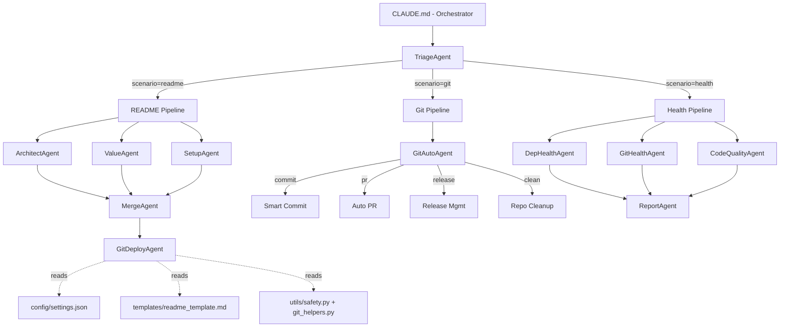

# GPSG - GitHub Project Showcase Generator

A multi-agent system that automates GitHub project documentation, Git workflows, and project health analysis through specialized pipeline-based AI agents.

GPSG transforms how developers maintain their open-source projects by replacing manual README writing, Git chore management, and health auditing with an orchestrated multi-agent pipeline. Users interact through natural language or shortcut commands (e.g., `gpsg readme .`, `gpsg health [path]`), and GPSG dispatches specialized agents in parallel to analyze code, extract value propositions, and produce production-ready outputs -- all with built-in safety guardrails that prevent destructive Git operations. The system is designed for Claude Code and leverages AI-native orchestration (parallel agents, checkpoint recovery, graceful degradation) rather than traditional CLI tools.

## Table of Contents

- [Features](#features)
- [Quick Start](#quick-start)
- [Architecture](#architecture)
- [Usage](#usage)
- [Agent Index](#agent-index)
- [Configuration](#configuration)
- [Safety Rules](#safety-rules)
- [Project Structure](#project-structure)

## Features

- **Multi-Agent Pipeline Architecture** -- GPSG decomposes complex tasks into specialized agents that run in parallel where possible and sequentially where necessary. Each agent has a clearly defined system prompt, structured dataclass outputs, and explicit input/output contracts.

- **Three Distinct Scenarios: README, Git Automation, and Health Analysis** -- The README pipeline generates architecture diagrams, value propositions, and setup guides, then merges them into a polished README deployed via PR. The Git pipeline handles smart commit messages, PR creation, release management, and repo cleanup. The Health pipeline produces a unified A-F graded report across dependency freshness, Git conformance, and code quality.

- **Natural Language Intent Recognition and Triage** -- Users do not need to memorize commands. TriageAgent parses natural language input (Chinese and English) and maps keywords to scenarios. It extracts parameters and performs pre-flight Git health checks before routing to the appropriate pipeline.

- **Safety-First Git Operations** -- Destructive commands like `git push --force`, `git reset --hard`, and `git clean -fd` are permanently banned. Sensitive file patterns are never committed. All destructive operations require explicit user confirmation. The system degrades gracefully when `gh` CLI is unavailable.

- **Checkpoint-Based Resilience and Graceful Degradation** -- GPSG writes checkpoint files after each phase, enabling mid-pipeline resume on interruption. If individual agents fail, the system continues with available outputs and generates placeholders for missing sections. Only when all parallel agents fail does the pipeline abort.

## Quick Start

### Prerequisites

- **Python 3.10+** (uses `from __future__ import annotations` with `X | Y` union syntax and `list[str]` builtin generics)
- **Git** (for version control and Git automation features)
- **Claude Code CLI** (GPSG runs within Claude Code's Agent SDK environment)
- **GitHub CLI (`gh`)** (optional, required for PR creation, release management, and deployment features; without it, GPSG degrades to local-only mode)

> **Note:** This project has no external Python dependencies. All imports use only the Python standard library (`dataclasses`, `typing`). No `pyproject.toml`, `requirements.txt`, or `setup.py` is required.

### Installation

```bash
# 1. Clone the repository
git clone https://github.com/KAG778/git_show.git
cd git_show

# 2. Create the GPSG workspace directories
mkdir -p .gpsg/agent_outputs .gpsg/merge .gpsg/final .gpsg/audit

# 3. Open Claude Code in the repository
claude

# 4. Use GPSG via natural language or shortcut commands
#    Examples:
#      "generate README"       -> README pipeline
#      "commit my changes"     -> Git commit pipeline
#      "create a PR"           -> Git PR pipeline
#      "check project health"  -> Health analysis pipeline
```

> **Important:** GPSG is not a standalone Python package with a CLI entry point. It operates as a structured prompt system within Claude Code. The `CLAUDE.md` file serves as the system prompt that instructs Claude Code how to orchestrate the agent pipeline.

### Verification

```bash
# Verify the project structure
ls -la agents/ config/ utils/ templates/

# Verify Python can parse all agent modules (syntax check)
python -c "
import ast, pathlib
for f in pathlib.Path('agents').rglob('*.py'):
    ast.parse(f.read_text())
    print(f'OK: {f}')
for f in pathlib.Path('utils').rglob('*.py'):
    ast.parse(f.read_text())
    print(f'OK: {f}')
print('All modules parsed successfully.')
"

# Verify config is valid JSON
python -c "import json; json.load(open('config/settings.json')); print('Config OK')"

# Verify Claude Code is available
which claude
```

## Architecture

<details>
<summary>Architecture</summary>



### Module Responsibilities

| Module | Path | Description |
|---|---|---|
| **CLAUDE.md** | `./` | Top-level orchestration manifest. Defines all pipelines, agent routing logic, shortcut commands, natural language triggers, and checkpoint conventions. |
| **TriageAgent** | `agents/triage.py` | Intent router that parses user natural language or shortcut commands, identifies the target scenario, extracts parameters, and runs pre-flight Git health checks. |
| **ArchitectAgent** | `agents/readme/architect.py` | Analyzes target repository structure: detects tech stack, generates file tree, identifies entry points, produces Mermaid architecture diagrams, and documents module responsibilities. |
| **ValueAgent** | `agents/readme/value.py` | Extracts project value proposition by analyzing release history, commit themes, existing documentation, and issue templates. All claims are evidence-based. |
| **SetupAgent** | `agents/readme/setup.py` | Generates Quick Start installation guides by detecting package managers, prerequisites, Docker support, CI/CD badges, environment variables, and verification commands. |
| **MergeAgent** | `agents/readme/merge.py` | Integrates outputs from Architect, Value, and Setup agents into a single polished README.md following open-source project standards, with conflict resolution rules. |
| **GitDeployAgent** | `agents/readme/git_deploy.py` | Deploys the generated README via feature branch + PR workflow. Handles dirty working trees, creates branches, commits, pushes, and opens PRs via `gh` CLI. |
| **GitAutoAgent** | `agents/git/git_auto.py` | Handles four Git automation sub-scenarios: smart Conventional Commits, automated PR creation, semantic versioning release management, and repository cleanup. |
| **DepHealthAgent** | `agents/health/dep_health.py` | Analyzes dependency health: detects package manager, checks for outdated packages, security vulnerabilities, and license compatibility. Grades A-F. |
| **GitHealthAgent** | `agents/health/git_health.py` | Evaluates Git repository health: branch structure, Conventional Commits conformance, oversized commits, remote sync, and .gitignore coverage. Grades A-F. |
| **CodeQualityAgent** | `agents/health/code_quality.py` | Assesses code quality: line counts, documentation completeness, test coverage, and configuration best practices. Grades A-F. |
| **ReportAgent** | `agents/health/report.py` | Synthesizes all three health check outputs into a unified health report with an overall grade, risk items, and improvement suggestions. |

</details>

## Usage

### Shortcut Commands

| Command | Action |
|---|---|
| `gpsg readme [path]` | Generate README for the target repo |
| `gpsg readme .` | Generate README for current directory |
| `gpsg commit` | Generate smart commit message |
| `gpsg pr` | Create PR from current branch |
| `gpsg release` | Create release with semver and changelog |
| `gpsg clean` | Repo maintenance and cleanup |
| `gpsg health [path]` | Analyze project health |

### Natural Language Triggers

GPSG activates when the user's input matches any of these intents:

- **README**: "generate README", "create documentation", "README"
- **Git Commit**: "commit", "commit my changes", "submit code"
- **PR**: "create PR", "pull request", "merge code"
- **Release**: "release", "publish", "tag"
- **Cleanup**: "cleanup", "repo maintenance", "clean branches"
- **Health**: "health", "check project health", "analyze project"

GPSG supports both English and Chinese natural language triggers.

### Example Workflows

**Generate a README for the current repository:**

```
gpsg readme .
```

GPSG will launch ArchitectAgent, ValueAgent, and SetupAgent in parallel. Once all three complete, MergeAgent synthesizes their outputs into a final README.md, and GitDeployAgent opens a PR.

**Create a Conventional Commits message:**

```
gpsg commit
```

GitAutoAgent analyzes the staged diff, infers the commit type (feat/fix/refactor/etc.), and generates a Conventional Commits formatted message.

**Audit project health:**

```
gpsg health .
```

DepHealthAgent, GitHealthAgent, and CodeQualityAgent run in parallel, each grading their dimension A-F. ReportAgent synthesizes a unified health report with an overall grade and prioritized improvement suggestions.

## Agent Index

| Agent | File | Scenario | Phase | Input | Output |
|---|---|---|---|---|---|
| TriageAgent | `agents/triage.py` | Entry (all) | 0 | User input | TriageResult |
| ArchitectAgent | `agents/readme/architect.py` | README | 1 | Repo path | ArchitectureAnalysis |
| ValueAgent | `agents/readme/value.py` | README | 1 | Repo path | ValueAnalysis |
| SetupAgent | `agents/readme/setup.py` | README | 1 | Repo path | SetupGuide |
| MergeAgent | `agents/readme/merge.py` | README | 2 | 3 analysis files | README.md |
| GitDeployAgent | `agents/readme/git_deploy.py` | README | 3 | README.md path | PR URL |
| GitAutoAgent | `agents/git/git_auto.py` | Git | 1 | Git sub-scenario | Commit/PR/Release/Cleanup result |
| DepHealthAgent | `agents/health/dep_health.py` | Health | 1 | Repo path | DepHealthResult |
| GitHealthAgent | `agents/health/git_health.py` | Health | 1 | Repo path | GitHealthResult |
| CodeQualityAgent | `agents/health/code_quality.py` | Health | 1 | Repo path | CodeQualityResult |
| ReportAgent | `agents/health/report.py` | Health | 2 | 3 health reports | Unified health report |

## Configuration

All configuration is managed through `config/settings.json`. The file defines:

| Section | Description |
|---|---|
| `agents` | Role definitions, phase assignments, input/output contracts for all 11 agents |
| `safety` | Banned Git commands, banned file patterns, and operations requiring user confirmation |
| `workspace` | Directory layout for `.gpsg/` working directories (outputs, merge, final, audit, checkpoint) |
| `defaults` | Default README template path, branch prefix (`gpsg/readme-refresh-`), commit message, and PR title |

No environment variables are required. All configuration uses hardcoded values within `config/settings.json`.

## Safety Rules

GPSG enforces strict safety guardrails defined in `utils/safety.py`. These rules apply to all agents and all Git operations.

**Banned Commands** (never executed under any circumstances):

- `git push --force` / `git push -f`
- `git reset --hard`
- `git clean -fd`
- `git branch -D` (must use `-d` with confirmation)
- `git push origin :*` (remote branch deletion)
- `rm -rf .git`

**Banned File Patterns** (never committed):

- `.env` files (`.env`, `.env.local`, `.env.production`)
- Credentials files (`credentials`, `*.key`, `*.pem`, `*.p12`, `*.pfx`)
- SSH keys (`id_rsa*`, `id_ed25519*`, `id_ecdsa*`, `*.keystore`)
- Secrets (`secret*`, `token*`, `password*`, `*.htpasswd`)

**Confirmation Required** for branch deletion, remote branch deletion, force push, tag deletion, and stash drop.

**Pre-commit Checks**: Before every `git commit`, the staged files are scanned against banned file patterns. If a match is found, the operation is aborted immediately.

**Graceful Degradation**: When `gh` CLI is unavailable, PR and release features are skipped and outputs are saved locally. When no remote is configured, changes are committed locally only. When the working tree is dirty, changes are stashed before deployment and restored after.

## Project Structure

```
git_show_agent/
├── CLAUDE.md                         # Claude Code system prompt / orchestration manifest
├── agent_create_plan.md              # Claude Code plan mode master plan
├── config/
│   └── settings.json                 # Global configuration (agents, safety, workspace)
├── templates/
│   └── readme_template.md            # Base template for MergeAgent output
├── agents/
│   ├── __init__.py                   # Package init
│   ├── triage.py                     # TriageAgent - intent routing
│   ├── readme/
│   │   ├── __init__.py               # Package init
│   │   ├── architect.py              # ArchitectAgent - architecture analysis
│   │   ├── value.py                  # ValueAgent - value proposition extraction
│   │   ├── setup.py                  # SetupAgent - installation guide generation
│   │   ├── merge.py                  # MergeAgent - README integration
│   │   └── git_deploy.py             # GitDeployAgent - Git PR deployment
│   ├── git/
│   │   ├── __init__.py               # Package init
│   │   └── git_auto.py              # GitAutoAgent - Git workflow automation
│   └── health/
│       ├── __init__.py               # Package init
│       ├── dep_health.py             # DepHealthAgent - dependency health check
│       ├── git_health.py             # GitHealthAgent - Git repo health check
│       ├── code_quality.py           # CodeQualityAgent - code quality analysis
│       └── report.py                 # ReportAgent - health report synthesis
└── utils/
    ├── git_helpers.py                # Git command reference
    └── safety.py                     # Safety rules / guardrails
```
